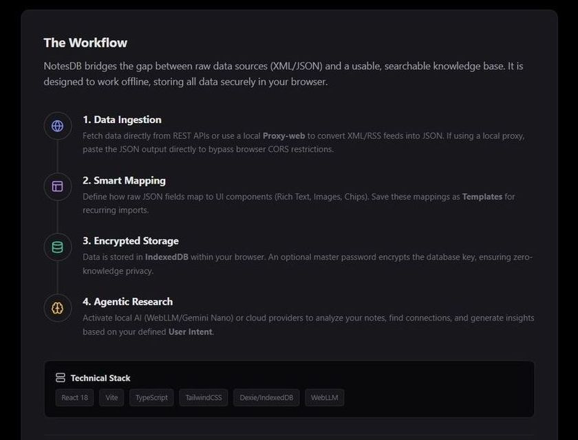
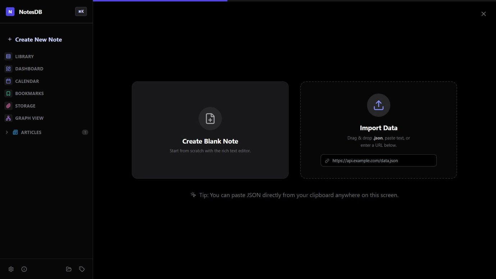
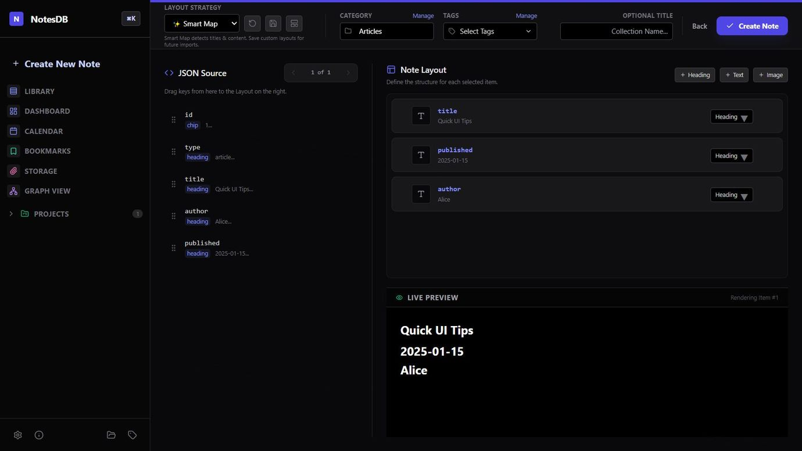
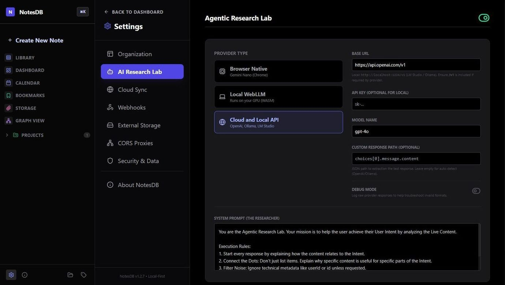
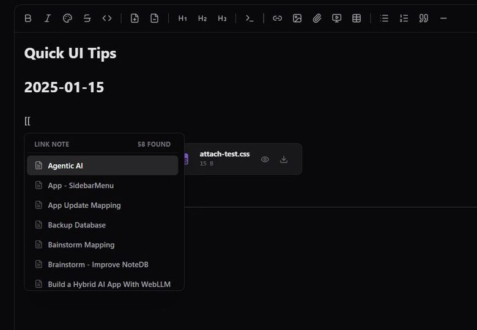
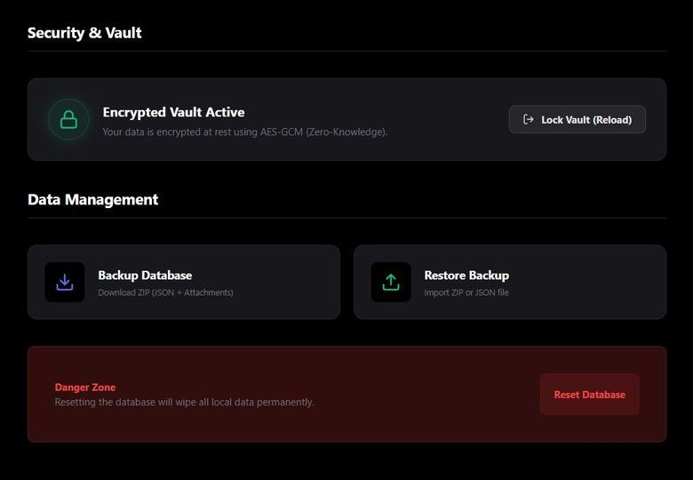
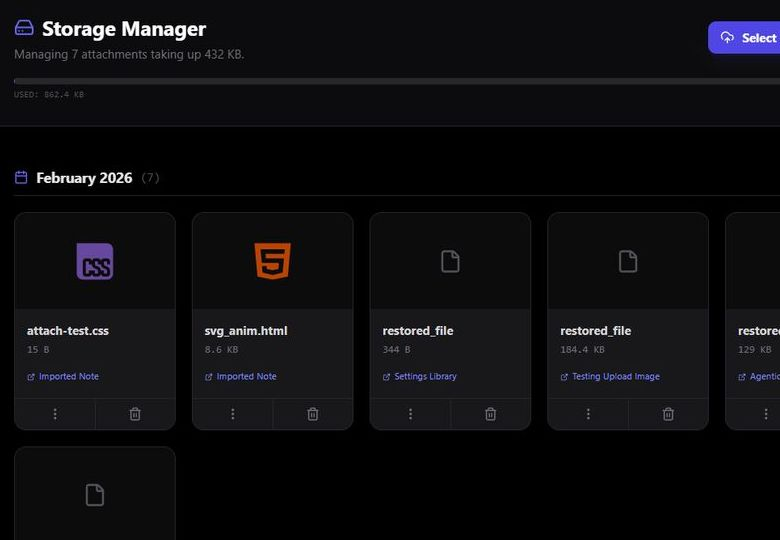
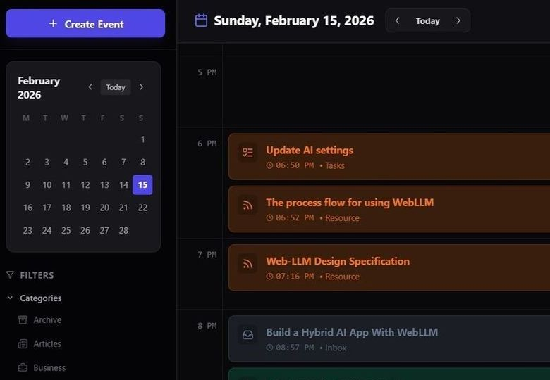
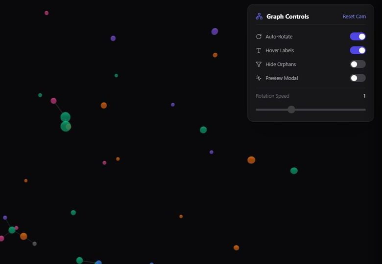
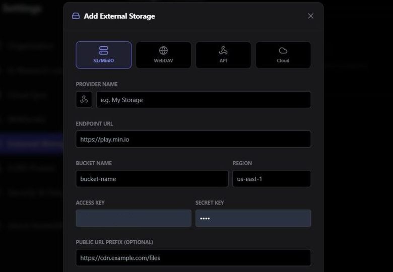

# NotesDB Local-First
**version 1.2.7**

NotesDB began as a noise-free tool designed to filter data and focus on essential information. It was originally created as a companion app for Proxy-Web, a client-side server that runs in the browser and generates typed JSON from RSS feeds. Proxy-Web follows a local-first architecture, storing queries in IndexedDB and serving them as an offline-capable API, even during network blackouts.
Over time, NotesDB naturally evolved into a full-featured note-taking application. It has since been extended with a calendar, a 3D graph view, and a bookmark manager, while maintaining strong privacy through the Web Crypto API for protecting sensitive information.

<picture align="center">

</picture>

<picture>
  
</picture>

### Create a Note or import JSON 

**Smart Import Wizard**: Auto-detects collections in JSON files or URLs and suggests mappings based on content analysis.

<picture align="center">

</picture>

### Mapping JSON to Note

**Visual Mapping Editor**: Drag-and-drop interface to define how JSON keys map to UI components (Headings, Text, Images).

<picture align="center">

</picture>

### Agentic AI Local-First

**Agentic AI**: Built-in "Research Lab" using local LLMs (WebLLM) or browser-native AI (Gemini Nano) for context-aware analysis.

<picture align="center">

</picture>

<picture>
  
</picture>

## 1. Summary

NotesDB is a specialized tool designed to bridge the gap between raw data dumps, originally from Proxy-Web XML converted to JSON, and usable knowledge. Its core mission is to **filter** complex JSON datasets, **map** relevant fields to semantic UI elements (Rich Text, Images, Code), and **save** them as clean, noise-free notes. By stripping away technical metadata and focusing on the content, it transforms machine-readable logs into human-readable insight, stored securely offline.

## 2. Quick Overview of Features

*   **Smart Import Wizard**: Auto-detects collections in JSON files or URLs and suggests mappings based on content analysis.
*   **Visual Mapping Editor**: Drag-and-drop interface to define how JSON keys map to UI components (Headings, Text, Images).
*   **Local-First Architecture**: 100% offline functionality using IndexedDB for storage.
*   **Encrypted Vault**: master password encryption for sensitive data.
*   **Rich Text Editor**: Integrated TipTap editor with syntax highlighting, slash commands, and media embedding.
*   **Agentic AI**: Built-in "Research Lab" using local LLMs (WebLLM) or browser-native AI (Gemini Nano) for context-aware analysis.
*   **Sync & Publish**: GitHub Gist integration for backup and sharing.
*   **Webhooks**: Automated event triggers for integration with external services (Discord, Slack, etc.).


<table>
<tr>
<td>
<picture align="center">

<br>Internal links
</picture>
</td>
<td>
<picture align="center">

<br>Encrypted Vault
</picture>
</td>
<td>
<picture align="center">

<br>Storage Manager
</picture>
</td>
</tr>
<tr>
<td>
<picture align="center">

<br>Calendar
</picture>
</td>
<td>
<picture align="center">

<br>3D Graph
</picture>
</td>
<td>
<picture align="center">

<br>Remote Storage
</picture>
</td>
</tr>
</table>

<picture>
  
</picture>

## 3. Development & Architecture

NotesDB is built as a highly optimized Single Page Application (SPA) focusing on performance and modularity.

### Stack

*   **Framework**: React 18 + Vite
*   **Storage**: Native IndexedDB (via `idb` wrappers)
*   **Styling**: Tailwind CSS
*   **Editor**: TipTap (Headless Prosemirror wrapper)

### Architecture Highlights

*   **Code Splitting**: The application utilizes `React.lazy()` and `<Suspense>` extensively. Heavy components like the `DashboardView`, `SettingsAdmin`, `LibraryView`, and modals are loaded only when requested. This keeps the initial bundle size small and ensures fast startup times.
*   **Service Layer**: Database operations are abstracted into `services/db.ts`, handling connection pooling, migrations, and transactions outside UI components.
*   **Optimized Rendering**: The editor uses `React.memo` to prevent re-renders during side-panel interactions.
*   **Agentic Sidebar**: The AI Research Sidebar is lazy-loaded but pre-fetched when AI is enabled, ensuring smooth animations without blocking the main thread during boot.

### Storage & Performance Strategy

*   **Data Organization**:
    *   `notes`: Stores the core JSON content and mapped metadata.
    *   `images`: Media is offloaded to a separate `attachments` store to keep the main note index lightweight and snappy.
    *   `stats`: Dashboard metrics are calculated on-demand without overhead.
*   **Native DB Counting**: To handle scaling (e.g., 10,000+ notes), the app strictly uses the raw `IDBObjectStore.count()` method for statistics. This is the community-recommended approach for maximum performance, providing the fastest single-operation way to retrieve totals without using cursors, iterating, or loading heavy records into memory.

## 4. Note Layout Engine

The "Note Layout" system is the core transformation engine (`components/Editor/MappingEditor.tsx`) that turns raw data into semantic views.

### Workflow

1.  **Auto-Detection**: The system analyzes the import to find the main data array. It uses heuristics in `mappingUtils.ts` to identify field types (e.g., keys containing "image" or "src" map to `IMAGE`, strings starting with "http" map to `LINK`).
2.  **Layout Builder**: A visual drag-and-drop interface.
    *   **Source (Left)**: Flattens nested JSON into draggable keys.
    *   **Canvas (Right)**: Stackable cards representing UI blocks.
3.  **Live Preview**: A split-pane view renders the actual HTML output in real-time using data from the selected sample item. This eliminates guesswork.

### Logic for Developers

*   **Mapping Rules**: stored as an array of `MappingRule` objects containing the `jsonPath` and `uiType`.
*   **Strict Type Checking**: The drag-and-drop handler (`isTypeCompatible`) prevents mismatched data (e.g., dragging a text block into an image slot) but allows logical coercions (e.g., any string can become a Heading).
*   **Type Overrides**: Each card includes a dropdown to manually force a specific renderer. Useful for edge cases where heuristics fail (e.g., a URL string that should be rendered as an image tag).
*   **Supported Types**:
    *   `HEADING`: Rendered as `<h2>`.
    *   `RICH_TEXT`: Renders HTML content safe for TipTap.
    *   `IMAGE`: Renders `` tags (handles URLs and Base64).
    *   `LINK`: Renders styled `<a>` tags with truncation.
    *   `CODE`: Renders inside `<pre><code>` blocks.
    *   `CHIP`: Renders as metadata badges.

## 5. Data Filtering & Plugins

### Evaluation of 'Auto-detect' Logic

The current `Auto-detect` feature (located in `utils/mappingUtils.ts`) uses a **Heuristic Depth-First Search (DFS)** to locate the primary data collection within a JSON blob.
*   **Strategy**: It recursively traverses the JSON object, looking for `Array` types.
*   **Selection Criteria**: It prioritizes the array containing the highest number of objects (`maxLen`).
*   **Limitation**: This approach is "greedy." It works well for standard API responses (e.g., `data.items[]`), but fails if the JSON contains a large array of metadata (e.g., `available_tags[]`) that happens to be larger than the actual content array.

### Smart Unwrapping

To address structural variations found in modern APIs and XML-to-JSON converters, the system implements a **universal flat mechanism** (`normalizeItems`). This allows filtering rules to remain simple (e.g., `category` instead of `article.category`) regardless of the wrapper depth.

**Supported Patterns:**
1.  **Single Nested Object** (`{ article: { ... } }`) → Automatically flattened to the inner object.
2.  **Flat List** (`[ {...}, {...} ]`) → Used as-is.
3.  **Polymorphic List** (`[ {type:"article", ...}, {type:"task", ...} ]`) → Treated as a flat list; fields vary but property access remains direct.

**A rapid research on market compatibility (2025–2026 Trends):**
*   **Flat array of objects** (~60–70%): GitHub API, Stripe, Twitter/X, OpenAI choices. Handled natively.
*   **Wrapped array** (~20–30%): Enterprise APIs (`{ data: [], meta: {} }`). Handled by DFS collection finding.
*   **Single nested object** (~10–15%): User profiles, webhooks, DB docs. Handled by Smart Unwrapping.
*   **Deep nesting** (<5%): Legacy XML conversions. Requires manual path selection via the Plugin Manager.

### Plugin Architecture (Draft Specification)

To address complex filtering needs beyond simple path selection, a **Runtime Plugin System** is proposed. This would allow the app to load custom logic without recompilation.

#### Concept

Instead of bundling filters at build time, the app would fetch filter scripts from the `/public/plugins/` directory at runtime. This allows for "Drop-in" extensibility in self-hosted environments.

#### Proposed Workflow

1.  **Location**: Place custom filter scripts in the `/public/plugins/` directory (e.g., `/public/plugins/jira.filter.js`).
2.  **Discovery**: On application boot, the system checks this path (requires server directory listing or a `manifest.json`) and imports the scripts.
3.  **Registration**: Valid plugins are registered in the `source_plugins` database.
4.  **Execution**: `Step2_Filter.tsx` executes the plugin's `process()` function against the raw JSON.

#### Example Interface (Draft)

```javascript
// public/plugins/issues.filter.js
export const meta = {
  name: "Issue Tracker Filter",
  id: "issue-filter-v1"
};

export const process = (rawJson) => {
  // Custom Logic
  const items = rawJson.data.filter(i => i.type === 'issue');
  return {
    path: 'data (filtered)',
    items: items
  };
};
```

#### Implementation Status

*   **Current State**: The application currently supports **Saved Path Plugins** (simple JSON path strings stored in DB).
*   **Pending**: The dynamic loading of external JS files from `/public/plugins` is **not yet implemented**. The smart mapping does an excellent job. 

## 6. Git Integration & Sync

The "Git Integration" feature serves two distinct purposes within the application ecosystem:

### 1. Configuration Backup (Settings Admin)

Allows users to back up their **Mapping Templates** and **Source Plugins** to a private Gist.
*   **Purpose**: Enables synchronizing your workflow configurations across multiple devices without exposing the entire database.
*   **Scope**: Only syncs logic (templates/plugins). It does **not** sync the Notes content.
*   **Security Protocol**: Sensitive credentials (AI API Keys, Personal Access Tokens, and Webhook URLs) stored in the encrypted `private` IndexedDB store are **strictly excluded** from the JSON payload sent to Git.

### 2. Note Publishing (Share Menu)

Enables one-click publishing of individual notes to Gists.
*   **Format**: Converts the internal HTML content to Markdown.
*   **Behavior**: Creates a new Gist or updates an existing one (if previously linked).
*   **Metadata**: Saves the resulting Gist ID back to the local note for future quick-updates.

## 7. UI Palette

A centralized color system ensures consistency across Tags, Categories, and the Editor text styles.

### Architecture
*   **Source of Truth**: `utils/uiConstants.ts` defines `SWATCH_COLORS` (Tailwind color names like 'indigo', 'zinc').
*   **Component**: `components/UI/Palette.tsx` renders these swatches. It supports two modes:
    *   `swatch`: Renders background colors (for Tags/Categories).
    *   `text`: Renders foreground text colors (for Editor).

### Implementation Details
*   **Dynamic Classes**: The app generates classes dynamically (e.g., `bg-${color}-500`).
*   **Editor Compatibility**: The TipTap editor's `@extension-color` strictly requires **Hex Codes**, not CSS classes.
    *   **Strategy**: The `Palette` component remains abstract, returning the color ID (e.g., `'red'`).
    *   **Conversion**: The consumer (e.g., `RichTextEditor.tsx`) maps this ID to a specific Hex code (e.g., `#ef4444`) before applying it to the editor state. This decoupling allows the UI to use flexible Tailwind themes while satisfying the editor's technical requirements.

## License

**MIT License**

Copyright (c) 2026 Nuno Luciano

Permission is hereby granted, free of charge, to any person obtaining a copy  
of this software and associated documentation files (the "Software"), to deal  
in the Software without restriction, including without limitation the rights  
to use, copy, modify, merge, publish, distribute, sublicense, and/or sell  
copies of the Software, and to permit persons to whom the Software is  
furnished to do so, subject to the following conditions:

The above copyright notice and this permission notice shall be included in all  
copies or substantial portions of the Software.

THE SOFTWARE IS PROVIDED "AS IS", WITHOUT WARRANTY OF ANY KIND, EXPRESS OR  
IMPLIED, INCLUDING BUT NOT LIMITED TO THE WARRANTIES OF MERCHANTABILITY,  
FITNESS FOR A PARTICULAR PURPOSE AND NONINFRINGEMENT. IN NO EVENT SHALL THE  
AUTHORS OR COPYRIGHT HOLDERS BE LIABLE FOR ANY CLAIM, DAMAGES OR OTHER  
LIABILITY, WHETHER IN AN ACTION OF CONTRACT, TORT OR OTHERWISE, ARISING FROM,  
OUT OF OR IN CONNECTION WITH THE SOFTWARE OR THE USE OR OTHER DEALINGS IN THE  
SOFTWARE.

---

Built with ❤️ (but no cookies 🍪 we respect your privacy and your health!)